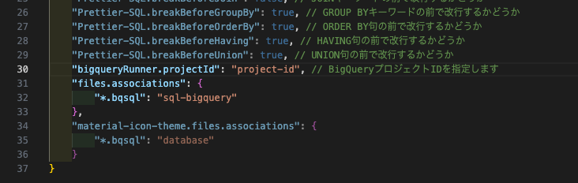
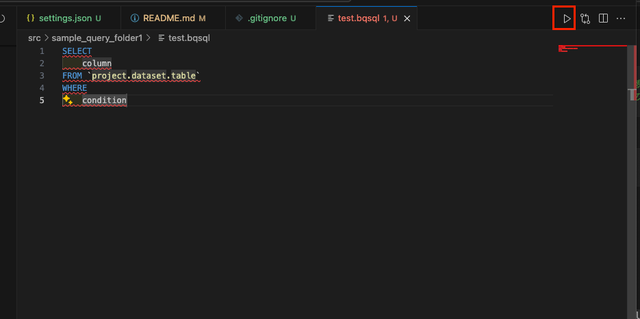
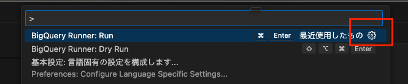
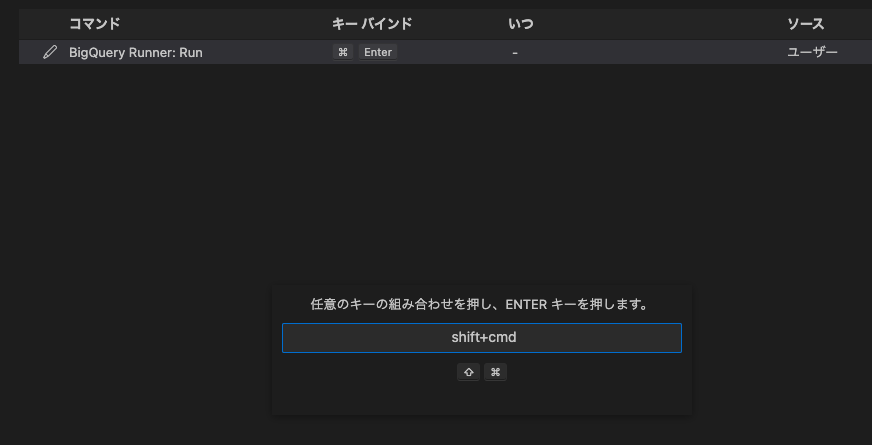
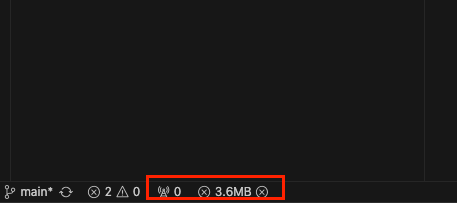
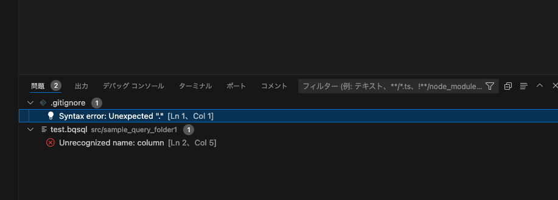
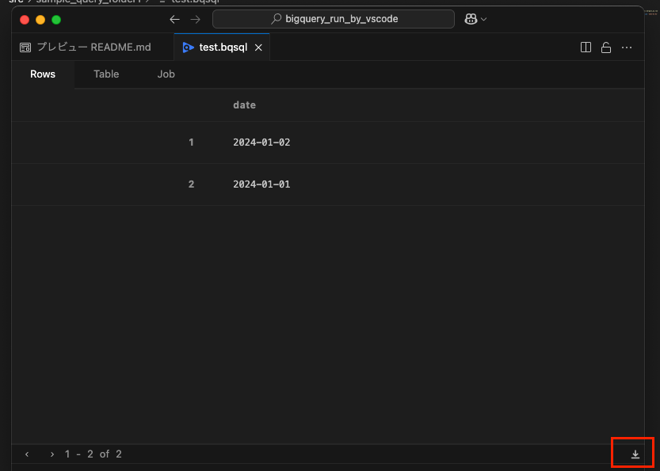
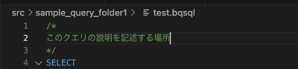

## 概要
VScode上でBigqueryをクエリし、Git管理できるようにするリポジトリです

## 初期設定
1. 仮想環境の構築

    以下を実行します
    ```bash
    python -m venv .venv  #.venvという仮想環境を作成
    source .venv/bin/activate  #仮想環境の有効化
    ```
    必要に応じてpythonのpipでインストールできます
    ```bash
    pip install XXX
    ```
1. 拡張機能の追加

    * [SQL Formatter VSCode](https://marketplace.visualstudio.com/items?itemName=ReneSaarsoo.sql-formatter-vsc)
    * [BigQuery Runner](https://marketplace.visualstudio.com/items?itemName=minodisk.bigquery-runner)
    * [SQL(BigQuery)](https://marketplace.visualstudio.com/items?itemName=shinichi-takii.sql-bigquery)
2. Google認証する

    * [gcloud CLIをインストール](https://cloud.google.com/sdk/docs/install?hl=ja)
    * `gcloud auth application-default login`ターミナルで実行

3. `settings.json`の設定
    BigQueryのproject_idを指定します

    
## 使い方
### クエリを作成する時
* ディレクトリ`src/folder`の配下に案件ごとのフォルダを作成してクエリのファイルを作成する
* `.bqsql`形式でファイルを作成する

### クエリするときの注意点
* クエリの実行

    画面上部の参画マークで実行できます
    
    ショートカットの登録もできます
    1. `cmd + shift + p`でショートカットを開き、「bigqueryRunner.run」と記入して歯車を押す

        

    2. ショートカットに指定したいコマンドを設定できます

        
* スキャン量の確認

    
* クエリエラー箇所の確認

    クエリを記述した際にエラーが発生している場合はこちらに入ります

    
* データのDL

    

* クエリの保存時

    * ファイルを保存`cmd + s`すると自動フォーマットが掛かります

        `SQL Formatter VSCode`という拡張機能のフォーマッターを利用しています
        `settings.json`で設定変更が可能です

    * ファイルの戦闘にどのようなクエリかを記述（未来の自分のために、なるべくわかりやすく記述することをおすすめします）

        
